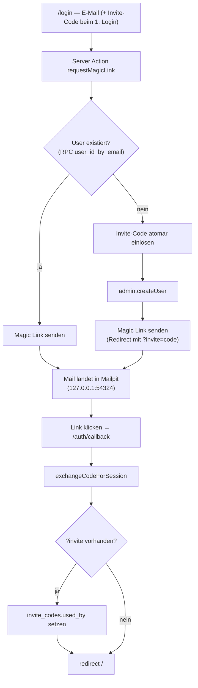

# Auth manuell testen

Schritt-für-Schritt-Anleitung, um den kompletten Login-Flow lokal von Hand
durchzuspielen — inklusive des Re-Login-Pfads, der über die RPC
`user_id_by_email` läuft (Migration `…_auth_user_lookup_rpc`).

Für den **Setup** des lokalen Stacks siehe zuerst
[getting-started.md](../setup/getting-started.md). Diese Datei setzt voraus, dass
Supabase läuft und `.env.local` gefüllt ist.

## Wie der Flow funktioniert (Kurzfassung)



- **Gating** ([src/lib/supabase/middleware.ts](../../src/lib/supabase/middleware.ts)):
  Nur `/login` und `/auth/callback` sind public. Alles andere ohne Session →
  Redirect auf `/login`. Mit Session auf `/login` → Redirect auf `/`.
- **Bekannter vs. neuer User**: Die Server Action
  ([src/app/auth/actions.ts](../../src/app/auth/actions.ts)) fragt per RPC
  `user_id_by_email`, ob die Adresse schon in `auth.users` existiert. Wenn ja:
  reiner Magic Link, **kein Code nötig**. Wenn nein: Invite-Code wird verlangt
  und atomar eingelöst.
- **Admin-Bootstrap**: `je.stefanou@gmail.com` ist in der ersten Migration als
  Bootstrap-Admin geseedet — der allererste Login mit dieser Adresse bekommt
  automatisch `is_admin = true` (via `handle_new_user`-Trigger).

## ⚠️ Wichtig: immer `127.0.0.1`, nie `localhost`

Greif die App lokal **ausschließlich über `http://127.0.0.1:3000`** ab — nicht
über `http://localhost:3000`. Supabase ist mit `site_url = http://127.0.0.1:3000`
konfiguriert ([supabase/config.toml](../../supabase/config.toml)), und GoTrue matcht
Redirect-URLs unter dem `site_url`-Host großzügig (Pfad + Query erlaubt), die
`localhost`-Einträge in `additional_redirect_urls` dagegen nur *exakt*. Ein
Magic-Link-Redirect mit `?invite=…` über `localhost` wird deshalb verworfen und
fällt auf die `site_url` zurück → der Login bricht ab.

`pnpm dev` zeigt im Banner zwar `http://localhost:3000` an — **ignorier das und
tipp `127.0.0.1:3000`** in den Browser. (In Prod existiert nur ein echter Host,
da gibt es das Problem nicht.)

## Vorbereitung

### 1. Stack & Dev-Server

```bash
pnpm exec supabase status     # läuft alles? sonst: pnpm exec supabase start
pnpm dev                      # dann im Browser http://127.0.0.1:3000 (NICHT localhost)
```

> Frische DB ohne User/Codes? `pnpm exec supabase db reset` fährt alle
> Migrations neu — danach ist `auth.users` leer und `je.stefanou@gmail.com` ist
> noch *kein* existierender User (gut für Test 1).

### 2. Einen Invite-Code anlegen

Codes werden bewusst **nicht** über die UI erzeugt (kein offenes Signup),
sondern per SQL. Zwei Wege:

**A — Studio (klickbar):** http://127.0.0.1:54323 → SQL Editor:

```sql
insert into public.invite_codes (code, note)
values ('TEST-AUTH1', 'manueller Auth-Smoketest');
```

**B — direkt über den DB-Container:**

```bash
docker exec -i "$(docker ps --filter name=supabase_db --format '{{.Names}}')" \
  psql -U postgres -d postgres \
  -c "insert into public.invite_codes (code, note) values ('TEST-AUTH1', 'manueller Auth-Smoketest');"
```

## Test 1 — Erster Login (neuer User + Invite-Code)

1. http://127.0.0.1:3000 öffnen → wirst auf `/login` umgeleitet (keine Session).
2. **E-Mail**: `je.stefanou@gmail.com`, **Invite-Code**: `TEST-AUTH1`.
   - Alternativ den Code per URL vorbefüllen: `/login?invite=TEST-AUTH1`.
3. „Magic Link anfordern" → grüne Bestätigung „Magic Link wurde an … gesendet".
4. **Mailpit** öffnen: http://127.0.0.1:54324 → neueste Mail → Magic Link klicken.
5. Erwartung: Redirect auf `/`, oben erscheint der Header mit deiner E-Mail und
   einem **„Abmelden"**-Button. ✅

> Die Startseite selbst ist noch das Next.js-Starter-Template — das ist bis
> Schritt 4 erwartet. Entscheidend ist der Header (= eingeloggt).

**Verifizieren (optional), dass der Code verbraucht wurde:**

```sql
select code, used_at, used_by from public.invite_codes where code = 'TEST-AUTH1';
-- used_at und used_by sollten gesetzt sein
```

## Test 2 — Logout

1. Im Header auf **„Abmelden"** klicken.
2. Erwartung: Redirect auf `/login`, Header verschwindet.

## Test 3 — Re-Login NUR mit E-Mail (der RPC-Pfad)

Das ist der Kern dessen, was Branch `chore/auth-followups` absichert: Ein
bereits existierender User darf sich **ohne** Invite-Code wieder einloggen.

1. Auf `/login`: nur **E-Mail** `je.stefanou@gmail.com`, Code-Feld **leer lassen**.
2. „Magic Link anfordern".
3. Erwartung: grüne Bestätigung — **kein** Fehler „Diese E-Mail ist uns nicht
   bekannt. Bitte Invite-Code angeben." Träfe dieser Fehler auf, wäre der
   User-Lookup kaputt (genau der `listUsers`→RPC-Bug).
4. Mailpit → Link klicken → wieder eingeloggt. ✅

**Verifizieren, dass die RPC den User findet:**

```sql
select public.user_id_by_email('je.stefanou@gmail.com');  -- gibt die UUID zurück
```

(Direkt nach `db reset`, bevor sich je jemand eingeloggt hat, gibt dieselbe
Query `NULL` zurück — dann existiert der User schlicht noch nicht.)

## Test 4 — Fehlerfälle Invite-Code (optional)

Auf `/login` mit einer **unbekannten** E-Mail (z. B. `neu@example.com`) und:

| Code-Eingabe | Erwartete Meldung |
| --- | --- |
| leer | „Diese E-Mail ist uns nicht bekannt. Bitte Invite-Code angeben." |
| `GIBTSNICHT` | „Invite-Code unbekannt." |
| `TEST-AUTH1` (schon in Test 1 verbraucht) | „Invite-Code wurde bereits eingelöst." |
| abgelaufener Code¹ | „Invite-Code ist abgelaufen." |

¹ Abgelaufenen Code zum Testen anlegen:
```sql
insert into public.invite_codes (code, note, expires_at)
values ('TEST-EXPIRED', 'abgelaufen', now() - interval '1 day');
```

## Aufräumen / Reset

```bash
pnpm exec supabase db reset   # DB komplett frisch, alle Test-User & Codes weg
```

Oder gezielt nur Testdaten löschen (DB bleibt sonst stehen):
```sql
delete from public.invite_codes where note like '%test%' or code like 'TEST-%';
-- Test-User entfernen: im Studio unter Authentication → Users, oder:
-- delete from auth.users where email = 'neu@example.com';
```

## Troubleshooting

| Symptom | Ursache / Fix |
| --- | --- |
| Erst-Login schlägt fehl / Link landet auf `/` statt eingeloggt | Du nutzt `localhost` statt `127.0.0.1` → GoTrue verwirft den `?invite=`-Redirect. Siehe Kasten oben. |
| Nach Link-Klick auf `/login` „ausgeloggt", obwohl gerade eingeloggt | Host-Mismatch (Cookie auf einem Host, Redirect auf anderen). Mit `127.0.0.1` durchgängig behoben; der Callback folgt dem Host-Header bzw. `NEXT_PUBLIC_SITE_URL`. |
| Magic-Link-Mail taucht nicht in Mailpit auf | Läuft der Stack? `pnpm exec supabase status`. Mailpit ist http://127.0.0.1:54324. |
| „Diese E-Mail ist uns nicht bekannt" trotz bekanntem User | RPC-Lookup-Bug — `select public.user_id_by_email('<mail>')` prüfen; Migration appliziert? |
| Nach Link-Klick zurück auf `/login` mit Fehlermeldung | Link abgelaufen/schon benutzt — neuen anfordern. Magic Links sind einmalig. |
| Redirect-Ziel stimmt in Prod nicht | `NEXT_PUBLIC_SITE_URL` auf die echte Domain setzen (siehe `.env.local.example`); lokal optional. |
