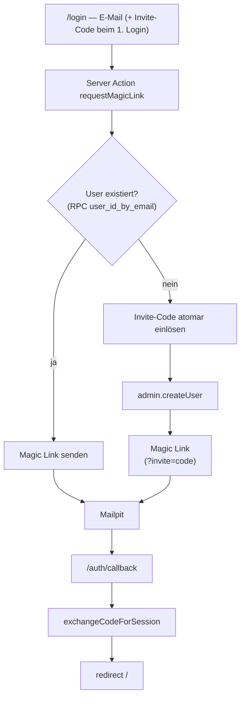

# Auth-Followups — RPC-User-Lookup, robuste Redirect-Origin, Test-Doku

## TL;DR

Zwei aus dem Auth-Review vor PR #2 vertagte Followups wurden umgesetzt: (1) der
User-Lookup beim Login läuft jetzt über eine RPC statt über `admin.listUsers`
(skaliert über 1000 Mitglieder hinaus), (2) Magic-Link-Redirects nutzen
`NEXT_PUBLIC_SITE_URL`. Beim End-to-End-Testen kam ein dritter, lokaler Bug ans
Licht (Post-Login-Bounce durch `localhost`/`127.0.0.1`-Host-Split), der direkt
mitgefixt wurde. Dazu eine neue Schritt-für-Schritt-Test-Doku. Alles verifiziert
(build/lint/`db reset`/Browser-E2E).

## Problem & Kontext

Im Code-Review vor PR #2 wurden zwei Schwachstellen notiert, aber vertagt:

- **`admin.listUsers({ perPage: 1000 })`** lud nur die erste Seite der User. Ab
  >1000 Mitgliedern würde ein bestehender User jenseits dieser Grenze als
  „unbekannt" eingestuft und beim Re-Login fälschlich nach einem Invite-Code
  gefragt.
- **Magic-Link-Redirect** wurde rein aus dem Host-Header gebaut — in Prod hinter
  Vercel fragil, kein expliziter `site_url`-Anker.

Beides war für das spätere Vercel-Deployment (Schritt 8) relevant und sollte vor
dem Weiterbauen abgeräumt werden.

## Branch- & Commit-Historie

- Abgezweigt von `main` @ `0311653` (Merge PR #3) am 2026-05-30 via `git switch -c chore/auth-followups`.
- Commits:
  - `ddc7696` — fix(auth): User-Lookup per RPC statt listUsers, Redirect-Origin robust
  - `a7e3226` — docs(auth): manuelle Test-Anleitung + Mailpit-Korrektur
  - *(dieser Report als Folge-Commit)*
- PR: #4 → `main`

## Entscheidungen

| Entscheidung | Optionen | Gewählt & Warum |
| --- | --- | --- |
| User-Existenz prüfen | A: `listUsers` paginiert / B: RPC auf `auth.users` | **B** — O(1), skaliert, kein Seiten-Handling. SECURITY DEFINER, nur `service_role`. |
| Redirect-Origin (Login-Action) | A: Host-Header / B: `NEXT_PUBLIC_SITE_URL` mit Fallback | **B** — proxy-/prod-robust, Host-Header bleibt lokaler Fallback. |
| Redirect-Origin (Callback) | A: `request.url` belassen / B: analog zu Login aus Env/Host-Header | **B** — `request.url` ist im Next-Dev immer `localhost` → Post-Login-Bounce. Mitgefixt nach Rücksprache. |
| Lokale Host-Falle | A: App-Code anpassen / B: dokumentieren + `127.0.0.1`-Regel | **B (für Facet a)** — die `?invite=`-Ablehnung sitzt in GoTrues Redirect-Matching, nicht im App-Code; daher dokumentiert. |

## Geänderte Dateien

### Neu

| Datei | Aufgabe | Begründung | Wichtigste Symbole |
| --- | --- | --- | --- |
| `supabase/migrations/20260530142419_auth_user_lookup_rpc.sql` | 5. Migration: RPC für E-Mail→User-Lookup | Ersetzt `listUsers`; nur für `service_role` ausführbar | `public.user_id_by_email(text)` (SECURITY DEFINER, `search_path=public,auth`) |
| `docs/testing-auth.md` | Manuelle Schritt-für-Schritt-Test-Anleitung für den Auth-Flow | Es gab keine Test-Doku; deckt RPC-Pfad + Host-Falle ab | Flow-Diagramm (Mermaid), Tests 1–4, Troubleshooting |

### Geändert

| Datei | Aufgabe der Datei | Was/Warum geändert | Wichtigste Symbole |
| --- | --- | --- | --- |
| `src/app/auth/actions.ts` | Server Actions für Login/Logout | `listUsers` → `admin.rpc("user_id_by_email")`; `emailRedirectTo` aus `NEXT_PUBLIC_SITE_URL` (Fallback Host-Header) | `requestMagicLink` |
| `src/app/auth/callback/route.ts` | OAuth-/Magic-Link-Callback | Redirect-`origin` aus `NEXT_PUBLIC_SITE_URL`/Host-Header statt `new URL(request.url).origin` | `GET` |
| `.env.local.example` | Vorlage für lokale Env | `NEXT_PUBLIC_SITE_URL` ergänzt (lokal optional, Prod = echte Domain) | — |
| `docs/getting-started.md` | Setup-Walkthrough | „Inbucket" → „Mailpit" korrigiert; Verweis auf Test-Doku | — |
| `.gitignore` | Ignore-Regeln | `.playwright-mcp/` (Browser-Automation-Artefakte aus dem E2E-Test) | — |

### Gelöscht

Keine.

## Architektur & Flows

### Login-Flow (Stand nach diesem Branch)

### Redirect-Origin: vorher → nachher

Sowohl die Login-Action als auch der Callback bauten ihre Redirect-URLs vorher
aus der Request-Quelle. Im Next-Dev liefert `new URL(request.url).origin` aber
**immer `localhost`** — unabhängig vom tatsächlichen Host. Da Supabase mit
`site_url = http://127.0.0.1:3000` läuft, lag die Session-Cookie auf `127.0.0.1`,
der Post-Login-Redirect zielte aber auf `localhost` → der User landete scheinbar
ausgeloggt auf `/login`.

| | Vorher | Nachher |
| --- | --- | --- |
| Login-Action `emailRedirectTo` | `${proto}://${host}` (nur Host-Header) | `NEXT_PUBLIC_SITE_URL` ?? Host-Header |
| Callback Redirect-`origin` | `new URL(request.url).origin` (= `localhost`) | `NEXT_PUBLIC_SITE_URL` ?? Host-Header ?? `request.url` |

### Host-Falle (dokumentiert, nicht im Code gefixt)

GoTrue matcht Redirect-URLs unter dem `site_url`-Host (`127.0.0.1`) großzügig
(Pfad + Query erlaubt), die `localhost`-Einträge in `additional_redirect_urls`
dagegen nur *exakt*. Ein Erst-Login-Redirect mit `?invite=…` über `localhost`
wird deshalb verworfen → Fallback auf `site_url`. **Regel:** lokal immer
`http://127.0.0.1:3000` benutzen (siehe `docs/testing-auth.md`).

## Datenbank / Migrationen

- **Neue Migration** `20260530142419_auth_user_lookup_rpc.sql` (5. insgesamt).
- **Reversibel:** ja, additiv (nur `create function` + grants). Ein Rollback
  wäre `drop function public.user_id_by_email(text);`.
- **Auswirkung lokal vs. Prod:** lokal über `db reset` verifiziert. Auf Prod
  greift sie erst beim nächsten `db push` bzw. wenn der „Deploy to production"-
  Toggle aktiviert ist (Schritt 8).

## Tests & Verifikation

- `pnpm build` ✅, `pnpm lint` ✅.
- `pnpm exec supabase db reset` ✅ (alle 5 Migrationen grün).
- RPC auf DB-Ebene: `secdef=t`, `search_path=public,auth`, EXECUTE nur
  `postgres`+`service_role`, bekannte Mail→UUID (case-insensitiv), unbekannt→NULL.
- **Browser-E2E** (über `127.0.0.1:3000`): Erst-Login mit Invite-Code, Re-Login
  nur per Mail (RPC-Pfad), Logout, `is_admin`-Bootstrap, `invite_codes.used_by`-
  Bookkeeping — alles ✅. Post-Login-Bounce nach dem Callback-Fix verschwunden.

## Risiken, Rollback & Auswirkungen

- **Risiko gering**: additive Migration, keine Schema-Breaking-Changes, keine
  Datenmigration.
- **Rollback**: Branch revert + (falls schon auf Prod) `drop function`-Migration.
- **Breaking changes**: keine. `NEXT_PUBLIC_SITE_URL` ist optional; ohne ihn
  greift der Host-Header-Fallback wie bisher.
- **Prod-To-Do (Schritt 8)**: `NEXT_PUBLIC_SITE_URL` auf die echte Domain setzen
  und die Redirect-URLs im Supabase-Dashboard pflegen.

## Offene Punkte / Follow-ups

- Doku-Reorg in Unterordner + allgemeine Test-Doku für Menschen + `reports/`-
  Infrastruktur (README + TEMPLATE) + AGENTS-Regel „Report vor jedem Merge" →
  eigener Branch `chore/docs-structure`.
- Optional: lokale `additional_redirect_urls` auf Wildcards erweitern, falls
  `localhost` lokal voll unterstützt werden soll.

## Zusammenfassung

Dieser Branch räumt die beiden vertagten Auth-Review-Followups ab und härtet den
Login-Flow an zwei Stellen. Der User-Lookup beim Login läuft nicht mehr über die
paginierte `admin.listUsers`-API, sondern über die neue SECURITY-DEFINER-RPC
`public.user_id_by_email`, die direkt in `auth.users` nachschlägt und nur für die
`service_role` ausführbar ist — damit funktioniert der Re-Login eines bestehenden
Mitglieds zuverlässig, egal wie viele Accounts existieren. Magic-Link-Redirects
verankern sich jetzt an `NEXT_PUBLIC_SITE_URL` statt nur am Host-Header, was vor
allem fürs spätere Vercel-Deployment robuster ist.

Beim manuellen End-to-End-Test (echte Magic Links aus Mailpit, per Browser
durchgeklickt) fiel ein bis dahin unbemerkter lokaler Bug auf: Der Callback baute
seinen Redirect aus `request.url`, das im Next-Dev konstant `localhost` ist,
während die Session-Cookie auf `127.0.0.1` (dem `site_url`-Host) lag — Ergebnis
war ein irreführender Post-Login-Bounce zurück auf `/login`. Nach kurzer
Rücksprache wurde der Callback analog zur Login-Action umgebaut. Eine zweite
Facette derselben Host-Problematik — GoTrue verwirft `localhost`-Redirects mit
`?invite=`-Query — sitzt in Supabases Redirect-Matching und ist deshalb nicht im
App-Code, sondern als „immer `127.0.0.1` benutzen"-Regel in der neuen
Test-Anleitung dokumentiert. Diese Anleitung (`docs/testing-auth.md`) schließt
eine Doku-Lücke und beschreibt den ganzen Flow inkl. Diagramm, Verifikations-
Queries und Troubleshooting. Alle automatisierbaren Checks sind grün.
