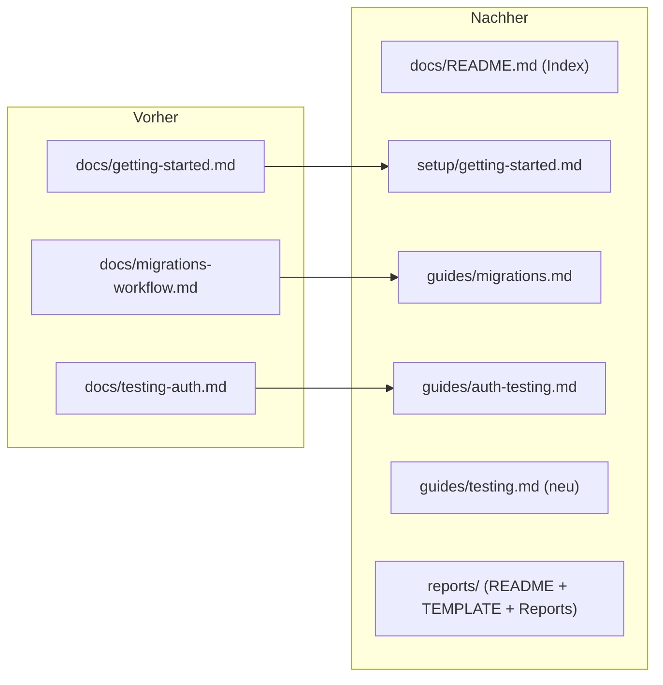

# Doku-Struktur + Branch-Report-Konvention

## TL;DR

`docs/` war flach und wuchs unstrukturiert. Dieser Branch ordnet die Doku in
Unterverzeichnisse (`setup/`, `guides/`, `reports/`), ergänzt einen
allgemeinen Test-Leitfaden für menschliche Devs und etabliert eine
Branch-Report-Konvention (Vorlage + Regel), damit vor jedem Merge dokumentiert
wird, was im Branch passiert ist — für Menschen und KI-Agents.

## Problem & Kontext

Drei Themen aus der Arbeit am `auth-followups`-Branch:

1. **Doku flach & ungeordnet** — `getting-started`, `migrations-workflow`,
   `testing-auth` lagen direkt in `docs/`; mit wachsender Zahl unübersichtlich.
2. **Keine allgemeine Test-Doku** — es gab nur die auth-spezifische Anleitung,
   nichts, was Testen im Projekt grundsätzlich erklärt (ohne Spezialwissen).
3. **Kein Format für „was wurde in diesem Branch gemacht"** — Wunsch nach einem
   ausführlichen Report pro Merge, nutzbar für Menschen *und* Agents.

## Branch- & Commit-Historie

- Abgezweigt von `main` @ `37278a5` (Merge PR #4) am 2026-05-30.
- Commits:
  - `b4dd7ae` — docs: Doku-Struktur (setup/guides/reports) + Branch-Report-Konvention
  - *(dieser Report als Folge-Commit)*
- PR: #5 → `main`

## Entscheidungen

| Entscheidung | Optionen | Gewählt & Warum |
| --- | --- | --- |
| Doku-Gliederung | A: flach lassen / B: Unterordner | **B** — `setup`/`guides`/`reports` trennen Erstaufsetzen, Abläufe, Branch-Historie; eine Ebene reicht für die Projektgröße. |
| Diagramme | ASCII / Mermaid | **Mermaid** (bereits in PR #4 umgesetzt) — diffbar, kein Verrutschen; GitHub rendert nativ. |
| Report-Durchsetzung | nur Konvention / Hook/CI | **Konvention** (AGENTS-Regel + PR-Template) als Start; CI-Erzwingung später möglich. |
| Report-Pfade bei späterem Refactor | mitziehen / Momentaufnahme | **Momentaufnahme** — Reports sind zeitpunktbezogen, Pfade werden nicht nachgezogen (in reports/README dokumentiert). |

## Geänderte Dateien

### Neu

| Datei | Aufgabe | Begründung | Wichtigste Inhalte |
| --- | --- | --- | --- |
| `docs/README.md` | Doku-Index / Wegweiser | Einstieg in die neue Struktur | Struktur-Baum + Linkliste |
| `docs/guides/testing.md` | Allgemeiner Test-Leitfaden | Lücke: bisher nur auth-spezifisch | statische Checks, lokales E2E, Migrations-Verifikation, Commit-Checkliste |
| `docs/reports/README.md` | Report-Konvention | „vor jedem Merge ein Report" festschreiben | Wann/Wo/Wie, Momentaufnahme-Hinweis |
| `docs/reports/TEMPLATE.md` | Report-Vorlage | einheitliche Struktur | Frontmatter + Standard-Abschnitte |
| `.github/pull_request_template.md` | PR-Kurz-Checkliste | erinnert an Report + Checks | Was/Warum + Checkliste |

### Geändert (inkl. verschoben)

| Datei | Aufgabe der Datei | Was/Warum geändert | — |
| --- | --- | --- | --- |
| `docs/setup/getting-started.md` (war `docs/getting-started.md`) | Lokales Setup | verschoben; interne Links + `../`-Tiefe nachgezogen; `localhost`→`127.0.0.1` | — |
| `docs/guides/auth-testing.md` (war `docs/testing-auth.md`) | Auth-Test-Anleitung | verschoben; Links nachgezogen | — |
| `docs/guides/migrations.md` (war `docs/migrations-workflow.md`) | Migrations-Workflow | reiner Move (keine Inhaltsänderung) | — |
| `README.md` | Projekt-Einstieg | Doku-Links auf neue Pfade + Index, `127.0.0.1` | — |
| `AGENTS.md` | Agent-Direktiven | Verzeichnis-/Link-Update, neue Regel „Report vor jedem Merge", `git checkout`→`git switch` | — |

### Gelöscht

Keine (alle Verschiebungen via `git mv`, History bleibt erhalten).

## Doku-Struktur: vorher → nachher

## Tests & Verifikation

- Reine Doku-/Markdown-Änderung — kein App-Code betroffen (`build`/`lint`
  unverändert grün).
- **Link-Check**: Skript über alle ``-Links in `README.md`, `AGENTS.md` und
  `docs/**/*.md` — alle relativen Links lösen auf existierende Pfade auf.

## Risiken, Rollback & Auswirkungen

- **Risiko minimal** — nur Doku. Keine Laufzeit-/Schema-Auswirkung.
- **Rollback**: `git revert` des Branch-Merges; `git mv` ist sauber reversibel.
- **Auswirkung**: Lesezeichen auf alte `docs/`-Pfade brechen; intern alle Links
  aktualisiert.

## Offene Punkte / Follow-ups

- **Test-Framework einrichten** (User-Wunsch, „lieber früh als spät") — eigener
  Branch `chore/test-setup`, idealerweise vor Schritt 4. Optionen/Details im
  PROJECT_PLAN-Backlog.
- Mermaid rendert auf GitHub nativ; in der VSCode-Vorschau braucht es die
  Extension „Markdown Preview Mermaid Support".

## Zusammenfassung

Dieser Branch ist reine Infrastruktur-Pflege an der Dokumentation. Die bisher
flache `docs/`-Ablage ist jetzt in drei sprechende Bereiche gegliedert: `setup/`
fürs Erstaufsetzen, `guides/` für Arbeitsabläufe (Testen allgemein, Auth-Test im
Speziellen, Migrations) und `reports/` für die neue Branch-Report-Konvention. Ein
`docs/README.md` dient als Wegweiser. Neu ist ein allgemeiner Test-Leitfaden, der
ohne Spezialvokabular erklärt, wie in diesem Projekt getestet wird (statische
Checks, lokales End-to-End, Migrations-Verifikation) — ehrlich am aktuellen Stand,
dass es noch kein Test-Framework gibt. Die Branch-Report-Konvention (Vorlage +
README + AGENTS-Regel + PR-Template) sorgt dafür, dass künftig vor jedem Merge
festgehalten wird, was und warum passiert ist; dieser Report ist zugleich das
erste Beispiel, das die Vorlage dogfooded. Alle Datei-Verschiebungen liefen über
`git mv` (History bleibt), und sämtliche internen Doku-Links wurden auf die neuen
Pfade gezogen und per Skript verifiziert.
