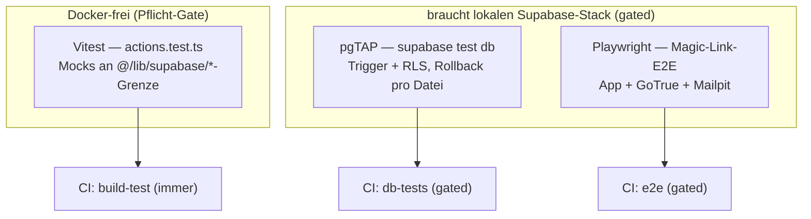

# Test-Framework (Vitest + pgTAP + Playwright) + CI

## TL;DR

Bisher gab es nur statische Checks (`build`/`lint`) und manuelles Browser-E2E.
Dieser Branch richtet einen geschichteten Test-Stack ein — **Vitest** (Unit für die
Auth-Server-Action), **pgTAP** (DB-Trigger + RLS gegen lokales Supabase), **Playwright**
(echter Magic-Link-Flow) — plus eine **GitHub-Actions-CI** mit schlankem Pflicht-Gate
und gated DB/E2E-Jobs. Nebenbei aufgefallen: `public.user_id_by_email` **segfaultet
Postgres**, wenn die Rolle `authenticated` sie aufruft (siehe Offene Punkte).

## Problem & Kontext

Schritt 3 (Auth) ist in `main` (PRs #1–#5). Vor Schritt 4 sollte ein Test-Framework
stehen (Beschluss 2026-05-30), damit neue Features gleich mit Tests entstehen.
Bisher: kein Test-Runner, keine DB-Tests, kein automatisiertes E2E, keine CI.

## Branch- & Commit-Historie

- Abgezweigt von `main` @ `6f01298` (Merge PR #5) am 2026-05-31.
- Commits:
  - `ae27f77` — test(auth): Vitest-Setup + Unit-Tests für requestMagicLink/signOut
  - `1f9281a` — test(db): pgTAP-Tests für Trigger + RLS-Policies
  - `aa8248b` — test(e2e): Playwright Magic-Link-Flow gegen lokalen Stack
  - `92a6d08` — ci: GitHub-Actions — Pflicht-Gate + gated DB/E2E
  - *(dieser Report als Folge-Commit)*
- PR: #6 → `main`

## Entscheidungen

| Entscheidung | Optionen | Gewählt & Warum |
| --- | --- | --- |
| Test-Tools | Vitest / Playwright / DB-Tests | **Alle drei** (User-Wunsch) — Unit für Logik, pgTAP für DB-Invarianten, Playwright fürs echte E2E. |
| Erster echter Scope | Gerüst / auth-actions / E2E | **`auth/actions.ts`** zuerst (genug Logik, Docker-frei) als Meilenstein, bevor irgendwas einen Stack braucht. |
| Alias in Vitest | vite-tsconfig-paths / expliziter Alias | **Expliziter Alias** in `vitest.config.mts` — `vite-tsconfig-paths` greift nur für tsconfig-`include`, Testdateien sind aber ausgeschlossen (sonst typecheckt `next build` sie); der explizite Alias deckt alle Importer ab (Plugin wieder entfernt). |
| Testdateien & Prod-Typecheck | inkludieren / ausschließen | **Ausschließen** (`*.test.ts`, `*.spec.ts`, `e2e/**`, `playwright.config.ts`) in `tsconfig.json` — hält `next build` schlank; Vitest/Playwright typechecken nicht. |
| DB-Test-Helfer | basejump vendoren / dbdev / eigener | **Eigener Mini-Helper** (`tests`-Schema) — keine Fremd-Datei, kein Lizenz-/Provenance-Thema, voll unter Kontrolle, gegen den Stack verifiziert. |
| RLS-Tiefe | pgTAP / pgTAP + JS-Smoke | **pgTAP-only** — transaktionale Rollback-Isolation, feuert auth.users-Trigger, exakte RAISE-Meldungen; kein HTTP-Layer nötig. |
| pnpm-Pin (CI) | `version: 11` / packageManager | **`packageManager: pnpm@11.1.2`** in package.json — eine Quelle, kein Float auf 11.x (sonst `--frozen-lockfile`-Drift). |
| Supabase-CLI in CI | setup-cli-Action / repo-CLI | **Repo-CLI** (`pnpm exec supabase`) — identische Version wie lokal (devDep), keine zweite Versions-Quelle. |
| CI-Gating | jeder PR / nur Label / Pfad+Label | **Pfad + Label-Override** — Pflicht-Gate (lint+build+unit) immer; DB/E2E nur bei Änderungen an auth/supabase/e2e/workflows oder Label `full-ci`. |

## Geänderte Dateien

### Neu

| Datei | Aufgabe der Datei | Begründung | Wichtigste Symbole |
| --- | --- | --- | --- |
| `vitest.config.mts` | Vitest-Konfiguration | Runner + Alias | node-Env, `@/`→`./src`-Alias |
| `src/app/auth/actions.test.ts` | Unit-Tests der Server Action | erster echter Scope | 16 Tests (Validierung, RPC, Invite-Claim, Diagnose, Origin, signOut) |
| `supabase/tests/000-test-helpers.sql` | Test-Helfer (`tests`-Schema) | RLS/Trigger as-user testen | `create_supabase_user`, `authenticate_as`, `get_supabase_uid` |
| `supabase/tests/010-triggers.test.sql` | pgTAP Trigger-Tests | DB-Invarianten | 10 Tests (handle_new_user, vote_budget, set_cycle_defaults, …) |
| `supabase/tests/020-rls.test.sql` | pgTAP RLS-Tests | Policies absichern | 14 Tests über alle 9 Tabellen |
| `playwright.config.ts` | E2E-Konfiguration | App bauen+starten, 127.0.0.1 | webServer, `workers:1`, `NEXT_PUBLIC_SITE_URL` |
| `e2e/helpers/mailpit.ts` | Magic-Link aus Mailpit lesen | E2E ohne echtes Postfach | `clearInbox`, `getMagicLink` |
| `e2e/auth-magic-link.spec.ts` | E2E des Auth-Flows | echter Login | Erst-Login + Negativ-Test |
| `.github/workflows/ci.yml` | CI | automatische Tests | `build-test`, `changes`, `db-tests`, `e2e` |

### Geändert

| Datei | Aufgabe der Datei | Was/Warum geändert | — |
| --- | --- | --- | --- |
| `package.json` | Projekt-Manifest | `packageManager: pnpm@11.1.2`, devDeps (vitest, @playwright/test), Test-Scripts | — |
| `tsconfig.json` | TS-Config | Test-/E2E-Dateien + `playwright.config.ts` vom Typecheck ausgeschlossen | — |
| `.gitignore` | Ignore-Liste | Playwright-Output (`test-results/`, `playwright-report/`, …) | — |

## Architektur & Flows

Drei Test-Ebenen, bewusst getrennt nach „braucht Docker?":



Der E2E-Flow hält den **gesamten** Magic-Link-Vorgang in einem Browser-Context
(PKCE-Code-Verifier-Cookie `sb-127-auth-token-code-verifier`), liest die Mail aus
der Mailpit-API und folgt dem Link bis zur eingeloggten App.

## Tests & Verifikation

- `pnpm test:run` → **16/16** grün (Vitest).
- `pnpm test:db` → **25/25** grün (1 Helper + 10 Trigger + 14 RLS) gegen lokalen Stack.
- `pnpm test:e2e` → **2/2** grün (Erst-Login + Negativ-Test); Testdaten danach restlos
  aufgeräumt (verifiziert: 0 zurückgebliebene Invite-Codes/User).
- `pnpm lint` + `pnpm build` weiterhin sauber (inkl. der neuen Dateien).
- CI-YAML validiert; die einzelnen Schritte (install/lint/build/test:run/test:db/test:e2e,
  Key-Mapping) sind lokal verifiziert. Die schweren Jobs laufen erstmals real im PR #6.

## Risiken, Rollback & Auswirkungen

- **Risiko niedrig** — reiner Test-/CI-Zusatz, keine Prod-Code- oder Schema-Änderung.
- **Rollback**: `git revert` des Merges; alle neuen Dateien sind additiv.
- DB/E2E-CI-Jobs fahren je einen `supabase start` (Docker, ~Minuten) — darum gated.

## Offene Punkte / Follow-ups

- **⚠️ Segfault in `public.user_id_by_email`** — Aufruf durch die Rolle `authenticated`
  (EXECUTE korrekt entzogen) **segfaultet den Postgres-Backend-Prozess (signal 11)** →
  instanzweiter Crash + Auto-Recovery. Reproduziert auf dem lokalen Supabase-Image.
  Repro:
  ```sql
  set role authenticated;
  set request.jwt.claims = '{"role":"authenticated"}';
  select public.user_id_by_email('x@y.z');  -- server process terminated by signal 11
  ```
  Eingegrenzt: `service_role`/`postgres` (haben EXECUTE) + `authenticated`→`is_admin()`
  laufen sauber; nur der **Permission-Denied-Pfad genau dieser Funktion** crasht
  (Unterschied: `set search_path = public, auth` + Zugriff auf `auth.users`). Der
  Auth-Flow selbst ist nicht betroffen (Server Action ruft die RPC als service_role).
  Im Test daher nur die EXECUTE-Garantie via `has_function_privilege` geprüft, **nicht
  aufgerufen** (sonst crasht die Test-DB). **Beschluss:** nach diesem Branch separat und
  gründlich untersuchen (minimaler Repro, Postgres-/Image-Version, Erreichbarkeit via
  PostgREST, ob das gehostete Prod-Postgres betroffen ist) → Bug-Report an Supabase +
  Entscheidung über Mitigation (z.B. Funktion in privates Schema verschieben).
- **Component-Tests** (z.B. LoginForm) bewusst aufgeschoben — bräuchten
  `@vitejs/plugin-react` + jsdom + testing-library + `test.projects`.
- **Coverage** (`@vitest/coverage-v8`) noch nicht eingerichtet — bei Bedarf nachrüstbar.

## Zusammenfassung

Der Branch etabliert eine geschichtete Test-Strategie für das Projekt. **Vitest** testet
die Auth-Server-Action `requestMagicLink`/`signOut` rein mit Mocks an der
`@/lib/supabase/*`-Grenze — 16 Tests, Docker-frei, als erster Meilenstein. **pgTAP**
prüft die DB-Invarianten direkt in Postgres: die fünf Trigger (Profil-Auto-Anlage,
Admin-Bootstrap, is_admin-Schutz, Stimmen-Budget, Cycle-Defaults, Master-Cycle-Sperre)
und die RLS-Policies über alle neun Tabellen, jeweils in einer pro Datei
zurückgerollten Transaktion und über ein eigenes, schlankes `tests`-Helfer-Schema statt
einer Fremd-Dependency — zusammen 25 Tests. **Playwright** spielt den echten
Magic-Link-Flow gegen den lokalen Stack durch: Invite-Code seeden, Formular abschicken,
die Mail aus Mailpit ziehen, dem Link im selben Browser-Context (wegen des
PKCE-Verifier-Cookies) bis in die eingeloggte App folgen, anschließend aufräumen. Die
**CI** trennt ein schnelles, Docker-freies Pflicht-Gate (lint + build + Vitest auf jedem
PR) von den schweren, gated Jobs (DB/RLS + E2E nur bei Änderungen an Auth/Supabase/E2E
oder per Label `full-ci`), nutzt die repo-gepinnte Supabase-CLI für Versions-Parität und
pinnt pnpm/Node deterministisch. Als Nebenbefund kam ein Postgres-**Segfault** ans Licht,
der nach diesem Branch eigens und gründlich untersucht wird.
