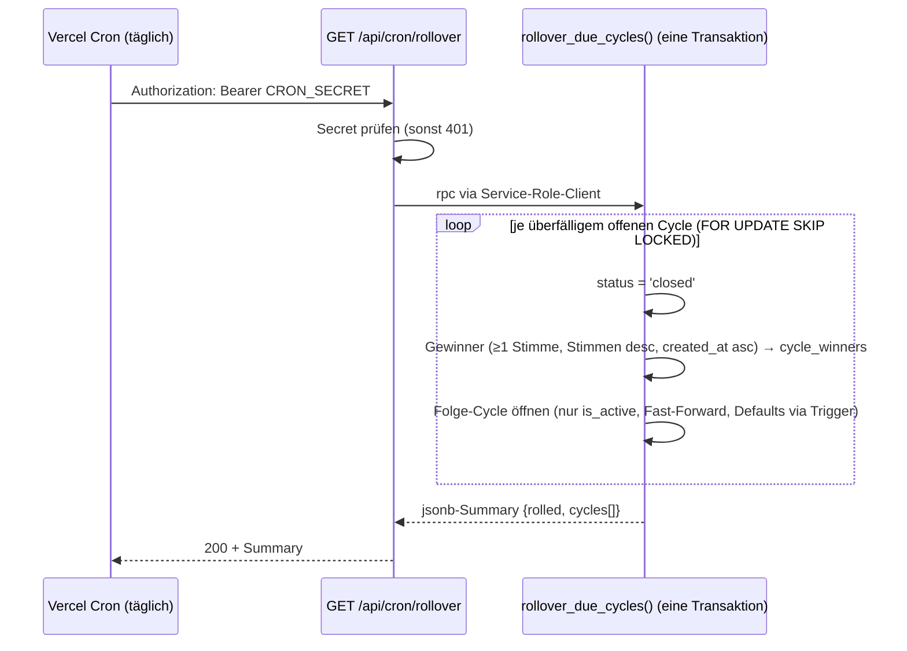

# Schritt 6a — Cycle-Rollover: Cron-Route, Gewinner-Ermittlung, Folge-Cycle

## TL;DR

Bisher blieb ein Cycle nach `ends_at` einfach offen — niemand hat ihn geschlossen, ausgewertet oder einen neuen geöffnet. Dieser Branch liefert die erste Hälfte von Schritt 6: eine DB-Funktion `rollover_due_cycles()` schließt überfällige Cycles transaktional, schreibt die Gewinner nach `cycle_winners` und öffnet den Folge-Cycle; getriggert wird sie täglich per Vercel Cron über `/api/cron/rollover`. Der Spotify-Push ist bewusst ausgeklammert (Schritt 6b, nach dem Owner-OAuth aus Schritt 7) — Cycles bleiben bis dahin auf `closed`.

## Problem & Kontext

Seit Schritt 5 leben Cycles in zwei zeitgesteuerten Phasen (Nominierung, dann Abstimmung), aber das Lebensende eines Cycles war offen gelassen: kein Prozess hat `status` auf `closed` gesetzt, Gewinner ermittelt oder den nächsten Wochen-Cycle angelegt. Zusätzlich war das Stimm-Fenster per RLS nur nach unten (`voting_starts_at`) begrenzt — nach `ends_at` konnte per API weiter gevotet werden, solange der Cycle formal offen war.

Der volle Schritt 6 (inkl. Spotify-Push) hängt am Owner-OAuth-Token aus Schritt 7. Entscheidung mit dem User: splitten, Rollover zuerst.

## Branch- & Commit-Historie

- Abzweig von `main` @ `382efae` (nach PR #13).
- Ein Commit (Squash-fähig), PR #14.

## Entscheidungen

| Entscheidung | Optionen | Gewählt & Warum |
| --- | --- | --- |
| Q6.1 Schritt-7-Abhängigkeit | Split 6a/6b · Schritt 7 vorziehen · alles in einem Branch | **Split**: Rollover ist unabhängig testbar, die App läuft für Mitglieder komplett durch; Push folgt nach Schritt 7 als 6b (`closed` → `pushed`). |
| Q6.2 Cron-Mechanik | Vercel Cron · pg_cron · Supabase Edge Function | **Vercel Cron** → Route Handler mit `CRON_SECRET`; Kernlogik trotzdem als DB-Funktion (RPC, nur `service_role`), damit Schließen + Auswertung + Folge-Cycle eine Transaktion sind. |
| Q6.3 Tie-Breaking | frühere Nominierung · Zufall · alle Punktgleichen | **Frühere Nominierung** (`song_nominations.created_at`, letzter Tie-Breaker `id`): deterministisch und identisch zur Sortierung der `/vote`-Top-Liste. |
| Q6.4 0-Stimmen-Gewinner | nie · nur Initial-Cycle · immer auffüllen | **Nie**: Gewinner brauchen ≥1 Stimme; ein Cycle kann weniger als `winners_count` Gewinner haben (auch der Initial-Cycle). |
| Cron-Frequenz | täglich · stündlich | **Täglich** (`30 3 * * *`): Hobby-Plan-Limit; überfällige Cycles hängen dadurch bis zu ~24h im Dead-Window — das deckt die RLS-Härtung + UI ab. Mit Vercel Pro später stündlich möglich. |
| Verpasste Läufe | Lücken-Cycles nachziehen · Fast-Forward | **Fast-Forward in ganzen Wochen**: der Folge-Cycle deckt die aktuelle Woche ab, statt Geister-Cycles in der Vergangenheit anzulegen; der Wochen-Rhythmus (`starts_at`-Raster) bleibt erhalten. |

## Geänderte Dateien

### Neu
| Datei | Aufgabe der Datei | Begründung | Wichtigste Symbole |
| --- | --- | --- | --- |
| `supabase/migrations/20260705170620_cycle_rollover.sql` | 8. Migration: Rollover-Funktion + RLS-Härtung | Kern von Schritt 6a | `rollover_due_cycles()`, Policies `votes_insert_self`/`votes_delete_self` |
| `src/app/api/cron/rollover/route.ts` | Cron-Endpoint | Vercel Cron → RPC-Durchreiche | `GET` (Bearer-Check, `admin.rpc("rollover_due_cycles")`) |
| `src/app/api/cron/rollover/route.test.ts` | Unit-Tests der Route | Auth-Gate + Fehler-Durchreiche | 5 Tests |
| `supabase/tests/030-rollover.test.sql` | pgTAP für den Rollover | Ranking, Tie-Break, 0-Stimmen, Fast-Forward, Idempotenz, Grants, Dead-Window-RLS | 21 Tests |
| `vercel.json` | Vercel-Cron-Konfiguration | Deploy-seitige Registrierung des Jobs | `crons[0]` |

### Geändert
| Datei | Aufgabe der Datei | Was/Warum geändert | Wichtigste Symbole |
| --- | --- | --- | --- |
| `src/lib/cycle-phase.ts` | Phasenlogik | dritter Zustand: Abstimmung vorbei, Cron noch nicht gelaufen | `votingEnded()` |
| `src/app/vote/page.tsx` | Voting-UI | überfällige offene Cycles ohne Vote-Buttons als „Abstimmung beendet — die Gewinner werden ermittelt" | `endedCycles` |
| `src/lib/supabase/middleware.ts` | Session-Gating im Proxy | `/api/cron` vom Login-Redirect ausgenommen (Route schützt sich selbst per `CRON_SECRET`) | `PUBLIC_PATHS` |
| `.env.local.example` | Env-Dokumentation | `CRON_SECRET` ergänzt | — |

## Architektur & Flows

Lebenszyklus eines Cycles jetzt: `open` (Nominierung → Abstimmung → ggf. Dead-Window bis zum Cron) → `closed` (Gewinner stehen fest) → `pushed` (kommt mit Schritt 6b). Die Phase innerhalb von `open` ergibt sich weiterhin rein aus der Uhrzeit; neu ist, dass `ends_at` auch API-seitig eine harte Grenze ist.

## Datenbank / Migrationen

8. Migration `20260705170620_cycle_rollover.sql`:

- **`rollover_due_cycles()`** — SECURITY DEFINER, EXECUTE nur `service_role` (Pattern wie `user_id_by_email`). Verarbeitet alle offenen Cycles mit `ends_at <= now()`: erst `closed` setzen, dann Gewinner-Insert, dann Folge-Cycle (`cycle_number = max+1`, `starts_at` = Vorgänger-`ends_at` ggf. wochenweise vorgespult, 7 Tage lang; `winners_count`/`voting_starts_at` füllt der bestehende Trigger `set_cycle_defaults`, `is_initial=false`). `FOR UPDATE SKIP LOCKED` macht parallele Doppel-Läufe harmlos. Rückgabe: jsonb-Summary für das Cron-Log.
- **RLS-Härtung** — `votes_insert_self`/`votes_delete_self` verlangen zusätzlich `now() < ends_at`. Schließt das Dead-Window (Daily-Cron: bis zu ~24h), in dem sonst nach Abstimmungsende noch Stimmen verändert werden konnten.

Nicht rückwärts-inkompatibel; lokal via `supabase db reset` (alle 8 Migrationen) verifiziert. Kein Daten-Backfill nötig.

## Tests & Verifikation

- `pnpm test:db`: 56 pgTAP-Tests grün, davon 21 neu in `030-rollover.test.sql` (Ranking/Tie-Break/Limit als `results_eq`, 0-Stimmen-Ausschluss, laufende + inaktive Playlists, Fast-Forward um genau eine Woche bei 10 Tagen Verzug, Folge-Cycle-Defaults, Idempotenz des Zweitlaufs, EXECUTE-Sperren, Dead-Window-RLS für Insert und Delete). Die EXECUTE-Sperre wird per `has_function_privilege` geprüft, nicht per Aufruf — bekannte supautils-3.2.0-Segfault-Falle (Report 2026-06-01).
- `pnpm test:run`: 60 Vitest-Tests grün, davon 5 neu für die Route (fehlendes Secret → 500, fehlender/falscher Header → 401, Ergebnis-Durchreiche, RPC-Fehler → 500).
- `pnpm build` + `pnpm lint` sauber; `/api/cron/rollover` ist dynamische Route.
- **Manueller Smoke-Test** (lokal): Seed-Cycle „Cooldown" per SQL überfällig gemacht, 3 Nominierungen (2/1/0 Stimmen), Route per curl: ohne/mit falschem Secret 401; mit Secret 200 und `rolled: 1`, 2 Gewinner (der 0-Stimmen-Song fehlt korrekt), Folge-Cycle Nr. 2 offen mit `winners_count 3`, 7 Tagen Länge, 4 Tagen Nominierung; Zweitaufruf `rolled: 0`. DB-Zustand per psql verifiziert.
- `pnpm test:e2e`: Magic-Link-Flow grün (relevant wegen der `PUBLIC_PATHS`-Änderung im Proxy).
- Aufgeräumt: Dev-Server gestoppt, `supabase db reset` nach dem Smoke-Test.

## Risiken, Rollback & Auswirkungen

- Die Route ist ohne gesetztes `CRON_SECRET` tot (500, kein Rollover) — Env-Var muss beim Vercel-Setup (Schritt 8) gesetzt werden; Vercel schickt sie dann automatisch als Bearer-Header.
- Daily-Cron heißt: Auswertung bis zu ~24h nach `ends_at`. Fachlich unkritisch (Stimmen sind ab `ends_at` eingefroren), sichtbar nur als „die Gewinner werden ermittelt" auf `/vote`.
- Rollback: Migration entfernen ginge nur per neuer Gegen-Migration (Policies zurückdrehen, Funktion droppen); Route/vercel.json sind additiv.
- Verhaltensänderung für Mitglieder: Stimmen lassen sich nach `ends_at` nicht mehr abgeben/zurückziehen (vorher API-seitig möglich — das war ein Loch, kein Feature).

## Offene Punkte / Follow-ups

- **Schritt 7**: Spotify-Owner-OAuth (Refresh-Token-Speicherung), danach **6b**: Push-Job (`closed` → `pushed`, `pushed_to_playlist_at`/`pushed_to_master_at` in `cycle_winners`, Master-Playlist-Befüllung).
- Cron-Frequenz auf stündlich anheben, falls das Projekt auf Vercel Pro läuft (nur `vercel.json`-Änderung).
- Bootstrap neuer Playlists (Cycle 1 anlegen) bleibt manuell/Studio bis zur Admin-UI in Schritt 8.
- `supabase` CLI meldet 2.109.0 (lokal 2.98.2) — bei Gelegenheit devDependency bumpen.

## Zusammenfassung

Mit diesem Branch schließt sich der Wochen-Kreislauf der App: Cycles enden nicht mehr im Nichts, sondern werden täglich von einem Vercel-Cron-Job eingesammelt. Die eigentliche Arbeit macht eine SECURITY-DEFINER-Funktion in Postgres, damit Schließen, Gewinner-Ermittlung und das Öffnen des Folge-Cycles atomar passieren und der Route Handler nur noch Auth-Gate und Durchreiche ist. Gewinner brauchen mindestens eine Stimme, Punktgleichheit entscheidet die frühere Nominierung — exakt die Ordnung, die Mitglieder auf `/vote` sehen. Das bisher offene Zeitfenster zwischen Abstimmungsende und Cron-Lauf ist jetzt beidseitig dicht: RLS friert die Stimmen ab `ends_at` ein, und die UI erklärt den Zustand, statt tote Buttons zu zeigen. Der Spotify-Push fehlt noch bewusst — er braucht den Owner-Token aus Schritt 7 und bekommt mit 6b einen eigenen, kleinen Anschluss-Branch.
