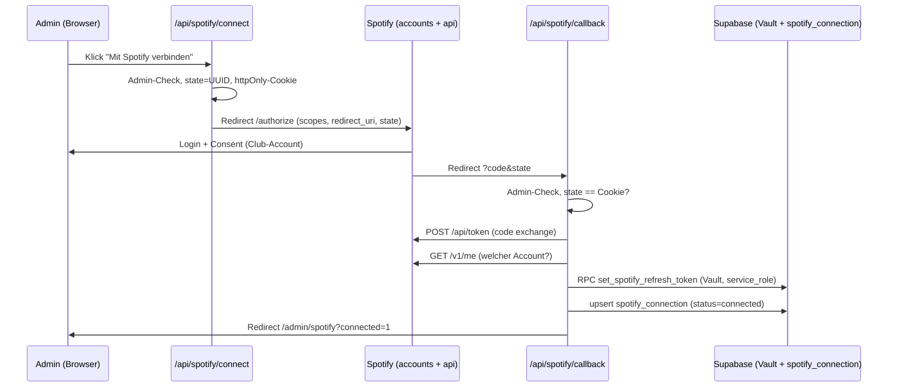

# Schritt 7 — Spotify-Owner-OAuth: Verbinden über Admin-Route, Refresh-Token im Vault

## TL;DR

Der wöchentliche Spotify-Push (Schritt 6b) braucht einen User-Kontext des
Playlist-Besitzers — das App-Token aus Schritt 4 kann keine Playlists schreiben.
Dieser Branch baut den Authorization-Code-Flow für den Owner-Account: Ein Admin
verbindet den Club-Account über `/admin/spotify` per Klick; der Callback legt den
Refresh-Token verschlüsselt im Supabase Vault ab (Zugriff nur über
service_role-RPCs) und protokolliert den Verbindungs-Status in der neuen
Singleton-Tabelle `spotify_connection`. Re-Auth nach Token-Ausfall ist derselbe
Ein-Klick-Flow — kein Env-Var-Kopieren, kein Redeploy.

## Problem & Kontext

Schritt 6a (PR #14) schließt Cycles und ermittelt Gewinner, lässt sie aber auf
`closed` stehen: Zum Schreiben in Spotify-Playlists fehlt ein OAuth-Token des
Playlist-Besitzers. Der Client-Credentials-Flow der Track-Suche hat keinen
User-Kontext. Schritt 7 beschafft und verwahrt dieses Token; der eigentliche
Push folgt als Schritt 6b.

Kernfragen dabei: Wie kommt der Token initial (und nach Widerruf erneut) in die
App, wo liegt er sicher, und wie fällt auf, wenn er stirbt — bevor der Cron-Push
wochenlang leise scheitert?

## Branch- & Commit-Historie

Abgezweigt von `main` @ `15c86d0` (nach Merge PR #15). PR #16.

Commits: siehe PR — der Branch ist als eine zusammenhängende Änderung gebaut.

## Entscheidungen

| Entscheidung | Optionen | Gewählt & Warum |
| --- | --- | --- |
| Q7.1 — Wie kommt der Token in die App? | (A) admin-gated Route in der App, (B) einmaliges lokales Skript | **A.** Der Callback kann den Token direkt persistieren; Re-Auth nach Ausfall ist ein Klick statt Handarbeit (Token kopieren, Redeploy). Wird in Schritt 8 zur vollen Admin-UI ausgebaut. |
| Q7.2 — Wo liegt der Refresh-Token? | Supabase Vault, `app_config`-Tabelle (Klartext), Vercel-Env-Var | **Vault.** Verschlüsselt at rest; Zugriff nur über SECURITY-DEFINER-RPCs mit EXECUTE ausschließlich für `service_role` (etabliertes Muster: `user_id_by_email`, `rollover_due_cycles`). PostgREST exponiert das `vault`-Schema nicht, daher Wrapper in `public`. Env-Var hätte den Callback-Write unmöglich gemacht (Q7.1-A ausgehebelt). |
| Q7.3 — Ausfall-Signal | Status in DB + Admin-Banner, zusätzlich E-Mail | **Status + Banner.** `spotify_connection` hält `connected`/`broken` + letzten Fehler; `/admin/spotify` zeigt „Verbindung getrennt — neu verbinden". Kein neuer Versand-Pfad. Das Broken-Markieren beim Refresh-Fail implementiert der Push-Job (6b); dieser Branch legt die Felder an. |
| Scopes | — | `playlist-modify-public playlist-modify-private` — genau was der Push-Job braucht, nicht mehr. |
| CSRF-Schutz | — | `state`-Parameter als UUID + httpOnly-Cookie (Pfad `/api/spotify`, 10 min TTL), Vergleich im Callback, Cookie wird in jedem Ausgang gelöscht. |
| Nicht-Admins auf `/admin/spotify` | Redirect vs. 404 | **404** (`notFound()`) — die Seite gibt ihre Existenz nicht preis. |

## Geänderte Dateien

### Neu
| Datei | Aufgabe der Datei | Begründung | Wichtigste Symbole |
| --- | --- | --- | --- |
| `supabase/migrations/20260705182305_spotify_owner_oauth.sql` | 9. Migration: Token-Storage + Status | Vault-Wrapper-RPCs (nur service_role) + Singleton-Tabelle mit Admin-Select-RLS | `set_spotify_refresh_token(text)`, `get_spotify_refresh_token()`, Tabelle `spotify_connection` |
| `src/lib/spotify-owner.ts` | Spotify-OAuth-Primitiven (serverseitig) | Authorize-URL, Code-Exchange, Profil-Abruf — vom Push-Job (6b) wiederverwendbar | `buildAuthorizeUrl`, `exchangeCodeForTokens`, `fetchOwnerProfile`, `OWNER_SCOPES`, `STATE_COOKIE` |
| `src/lib/admin.ts` | Admin-Gate für Seiten/Routen | Erster admin-gated Bereich der App; Wiederverwendung in Schritt 8 | `getAdminUserId` |
| `src/lib/site-origin.ts` | Origin-Ableitung für Request-Handler | Dieselbe Logik wie Auth-Callback/-Action, als Helper für die neuen Routen | `siteOrigin` |
| `src/app/api/spotify/connect/route.ts` | Flow-Start | Admin-Check, state-Cookie setzen, Redirect zum Spotify-Consent | `GET` |
| `src/app/api/spotify/callback/route.ts` | Flow-Abschluss | state prüfen, Code tauschen, Token in Vault (RPC), Status upserten; Fehler als `?spotify_error=<key>` | `GET` |
| `src/app/admin/spotify/page.tsx` | Admin-Seite Spotify-Verbindung | Status anzeigen (nicht verbunden / verbunden als X / getrennt + letzter Fehler), Verbinden-Button, Fehler-Übersetzung | `AdminSpotifyPage`, `ERROR_MESSAGES` |
| `supabase/tests/040-spotify-oauth.test.sql` | pgTAP für Migration 9 | RLS/Grants/Singleton/Vault-Roundtrip absichern | 15 Tests |
| `src/lib/spotify-owner.test.ts` | Vitest für die OAuth-Primitiven | URL-Bau, Basic-Auth, Body, Fehlerpfade | 7 Tests |
| `src/app/api/spotify/connect/route.test.ts` | Vitest für Flow-Start | Admin-Gate, config-Fehler, Cookie/State-Paar | 3 Tests |
| `src/app/api/spotify/callback/route.test.ts` | Vitest für Flow-Abschluss | alle Fehlerpfade, Speicher-Reihenfolge (Token vor Status), Cookie-Löschung | 11 Tests |

### Geändert
| Datei | Aufgabe der Datei | Was/Warum geändert | Wichtigste Symbole |
| --- | --- | --- | --- |
| `src/components/Header.tsx` | Globale Navigation | „Admin"-Link, nur für Admins sichtbar (Ziel-Seiten prüfen selbst nochmal) | `Header` |
| `docs/guides/spotify-setup.md` | Spotify-Anleitung | Abschnitt 6 „Owner-OAuth verbinden": Redirect-URI-Registrierung, Flow, Vault-Ablage, Dev-Mode-Hinweis | — |
| `.env.local.example` | Env-Vorlage | `SPOTIFY_REFRESH_TOKEN`-Platzhalter entfernt (Token liegt im Vault, nicht in Env); Hinweis auf Redirect-URI | — |

## Architektur & Flows

Reihenfolge im Callback ist bewusst: erst Token in den Vault, dann Status —
`spotify_connection` behauptet nie `connected` ohne gespeicherten Token.

Der Lesepfad für 6b: Push-Job (service_role) holt den Token per
`get_spotify_refresh_token()` und tauscht ihn gegen Access-Tokens; scheitert der
Refresh (`invalid_grant`), setzt der Job `status='broken'` + `last_error` — das
Banner auf `/admin/spotify` und der „Neu verbinden"-Klick existieren dafür schon.

## Datenbank / Migrationen

Migration 9 (`20260705182305_spotify_owner_oauth.sql`):

- **`spotify_connection`** — Singleton (PK `id boolean default true` + Check
  `id`): `status` (`connected`/`broken`), `spotify_user_id`,
  `spotify_display_name`, `connected_by` (FK profiles, `on delete set null`),
  `connected_at`, `last_error`, `last_error_at`. RLS an; einzige Policy:
  SELECT für Admins. INSERT/UPDATE/DELETE-Grants für `authenticated` entzogen,
  alles für `anon` — geschrieben wird nur mit Service-Role.
- **`set_spotify_refresh_token(text)` / `get_spotify_refresh_token()`** —
  SECURITY DEFINER (`search_path = ''`), EXECUTE nur `service_role`. Set macht
  Upsert im Vault (ein Secret `spotify_owner_refresh_token`, Update statt
  Duplikat), leerer Token wird abgewiesen.

Vorab lokal verifiziert: `supabase_vault` 0.3.1 im Stack; `postgres`
(Function-Owner) hat EXECUTE auf `vault.create_secret`/`update_secret` und
SELECT auf `vault.decrypted_secrets`.

Reversibel: Tabelle + Funktionen droppen, Vault-Secret
`spotify_owner_refresh_token` löschen. Kein Bestandsdaten-Einfluss.

## Tests & Verifikation

- `pnpm build` + `pnpm lint` sauber; `supabase db reset` mit 9 Migrationen grün.
- **pgTAP** (`test:db`, 71 gesamt, 15 neu): RLS aktiv; Nicht-Admin sieht keine
  Row, Admin liest sie; Writes für `authenticated` (auch Admins) gesperrt;
  Singleton-Constraints (23505/23514); EXECUTE-Rechte der RPCs (authenticated/
  anon entzogen, service_role vorhanden — via `has_function_privilege`, NICHT
  per Aufruf: der Permission-Denied-Pfad segfaultet im lokalen Stack, supautils
  < 3.2.2, siehe Report 2026-06-01); Vault-Roundtrip inkl. Überschreiben als
  service_role.
- **Vitest** (`test:run`, 81 gesamt, 21 neu): OAuth-Primitiven (URL-Parameter,
  Basic-Auth, Body, Fehler), Connect-Route (Admin-Gate, config-Fehler,
  Cookie/State-Paar), Callback-Route (alle Fehler-Keys, Token-vor-Status-
  Reihenfolge, Cookie-Löschung in jedem Ausgang).
- **Browser (manuell, Playwright):** Login als Bootstrap-Admin → „Admin"-Link
  erscheint → `/admin/spotify` zeigt „Noch kein Account verbunden" → Klick
  landet auf `accounts.spotify.com` mit korrekten Scopes/redirect_uri/state →
  Callback mit falschem state zeigt das Sicherheits-Banner → simulierte
  DB-Zustände rendern „Verbunden als …" bzw. „Verbindung getrennt + letzter
  Fehler". Danach `db reset` (Testdaten weg).
- **Nicht getestet:** der echte Spotify-Consent (braucht die Club-Account-
  Credentials und die registrierte Redirect-URI) — siehe Follow-ups.

## Risiken, Rollback & Auswirkungen

- Der Refresh-Token ist das wertvollste Secret der App. Absicherung: Vault-
  Verschlüsselung, kein PostgREST-Zugriff aufs vault-Schema, RPC-EXECUTE nur
  service_role, Token wandert nie in Client-Code oder Env-Dateien.
- Spotify rotiert Refresh-Tokens beim Refresh gelegentlich; das behandelt der
  Push-Job in 6b (neuen Token per `set_spotify_refresh_token` zurückschreiben).
- supautils-Segfault (lokal): die neuen RPCs dürfen lokal nicht als
  `authenticated`/`anon` aufgerufen werden — bekanntes Image-Problem, vor
  Deploy Prod-Image auf supautils ≥ 3.2.2 prüfen (bestehender Merker Schritt 8).
- Rollback: Branch revert; Migration ist additiv (Drop-Anleitung oben).

## Offene Punkte / Follow-ups

- **Vor dem ersten echten Verbinden:** Redirect-URI im Spotify-Dashboard
  registrieren (`http://127.0.0.1:3000/api/spotify/callback` lokal,
  `https://<domain>/api/spotify/callback` Prod) — Anleitung in
  docs/guides/spotify-setup.md §6. Danach einmal den echten Flow durchklicken.
- **Schritt 6b (nächster Schritt):** Push-Job — `get_spotify_refresh_token()`
  → Access-Token → Gewinner in Playlists + Master, `closed` → `pushed`;
  bei `invalid_grant` `status='broken'` + `last_error` setzen; rotierten
  Refresh-Token zurückschreiben.
- Schritt 8: `/admin/spotify` in eine volle Admin-UI einbetten (Invites,
  Playlists, Cycle-Übersicht).

## Zusammenfassung

Schritt 7 verdrahtet den Spotify-Owner-Account mit der App, ohne dass je ein
Token durch Hände oder Env-Dateien wandert. Ein Admin klickt auf
`/admin/spotify` auf „Mit Spotify verbinden", bestätigt den Consent mit dem
Club-Account, und der Callback legt den Refresh-Token verschlüsselt im Supabase
Vault ab — lesbar nur für die Service-Role über eine dedizierte RPC. Der
Verbindungs-Status (wer, wann, kaputt?) liegt in der Singleton-Tabelle
`spotify_connection`, die nur Admins sehen und nur die Service-Role schreibt.
Der OAuth-Flow ist CSRF-geschützt (state-Cookie), jeder Fehlerpfad landet als
übersetzte Meldung auf der Admin-Seite, und die Speicher-Reihenfolge (Token vor
Status) garantiert, dass „connected" nie lügt. Damit hat Schritt 6b alles, was
der wöchentliche Push braucht: Token holen, pushen, und im Fehlerfall den
Admins über das vorhandene Banner Bescheid geben.
